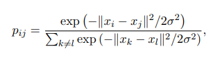
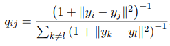
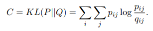
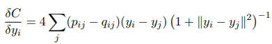
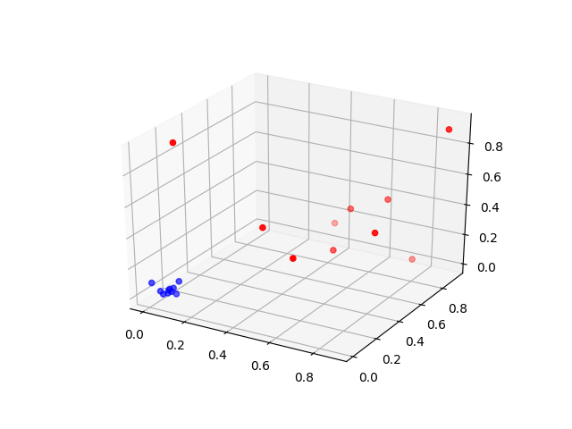
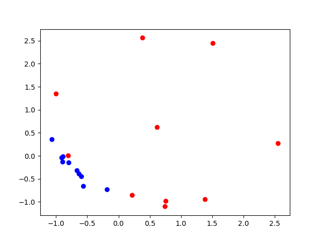

## t-SNE

t-distributed stochastic neighbor embedding (t-SNE) is a machine learning algorithm for dimensionality reduction developed by Geoffrey Hinton and Laurens van der Maaten.[1] It is a nonlinear dimensionality reduction technique that is particularly well-suited for embedding high-dimensional data into a space of two or three dimensions, which can then be visualized in a scatter plot. Specifically, it models each high-dimensional object by a two- or three-dimensional point in such a way that similar objects are modeled by nearby points and dissimilar objects are modeled by distant points. (source : Wikipédia)

The formula to compute the similarity between two points xi,xj in the original space

The formula to compute the similarity between two points yi,yj in the new space

The formula to compute the error between the two distributions by using Kl-divergence :

The derivative of the above formula to update the yi (using gradient descent):

Here is an example of the algorithm with points in 3D :

When we apply t-SNE, we obtain the following :

